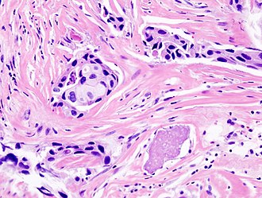
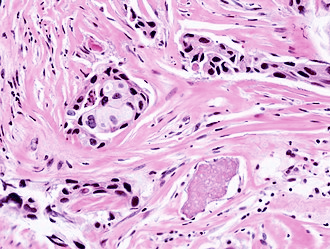
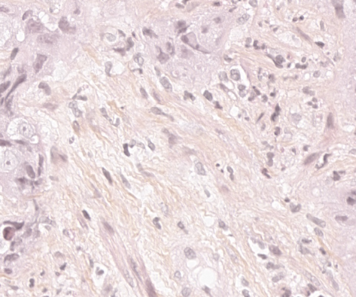
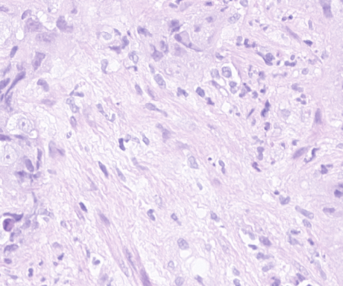

# Stain Separation and Normalization Pipeline

Creation in progress

This repo contains a code for WSI tiles conversion from HES to HE color. For now, only a basic method was implemented.

## Getting Started

### Installation

1. Clone the repository:
```bash
git clone https://github.com/EveDelegue/StainSeparationGeneralPipeline.git
cd StainSeparationGeneralPipeline
```

2. Install dependencies:

for Windows
```bash
python -m venv .venv
.\.venv\Scripts\activate
pip install -r .\requirements.txt
```

for Linux
```bash
python -m venv .venv
source .venv/bin/activate
pip install -r requirements.txt
```

### Dataset Preparation

To apply the method to your images, put them in a `data` folder as such :

StainSeparationGeneralPipeline/
```text
├── conf
├── data/     
│   ├── dataset_1/       
│   │   ├── img_1.png              
│   │   ├── img_2.jpg           
│   │   └── ...               
│   └── dataset_2/     
│       ├── img_1.png              
│       ├── img_2.jpg           
│       └── ...      
└── ...    
```
The dataset and images names don't matter. You will then need to write the name of the dataset you want to use in the ```conf\config.yaml``` file. 
```yaml
paths: 
    dataset: <your dataset name>
    ...
```
## Usage

The main script can be run with the command
```bash
python main.py
```

It creates a ```results``` folder with this structure :
```text
├── results/     
│   ├── img_1/       
│   │   ├── sample_0.png # H chanel              
│   │   ├── sample_1.png # E chanel
│   │   ├── sample_2.png # S chanel              
│   │   ├── sample_full.png # reconstructed HES image
│   │   └── sample_HE.png # reconstructed HE image
│   └── img_2/              
│       └── ...      
└── ...    
```
### Parameters

Parameters can be changed in the ```conf\config.yaml``` file. For now it contains : 
| Parameter | Description | Default |
|-----------|-------------|---------|
| `paths: dataset` | path to the image dataset | data\dataset_0 |
| `verbose` | should the code save images other than the HE output | True |
| `paths: verbose` | where the code saves images | results |
| `colors: W0` | the RGB colors used to decompose the image | H = (73.0,119.0,185.0) E = (245.0,143.0,204.0) S = (248.0,245.0,152.0)|

### Example Commands

```bash
python main.py paths.verbose=my_results
```

runs the code and saves the images in ```my_results``` instead of ```results```
## Results

| Original image | Output image |
|-----------|-------------|
| | |
||    |

## Contributing

Contributions are welcome! Please feel free to submit a Pull Request.

